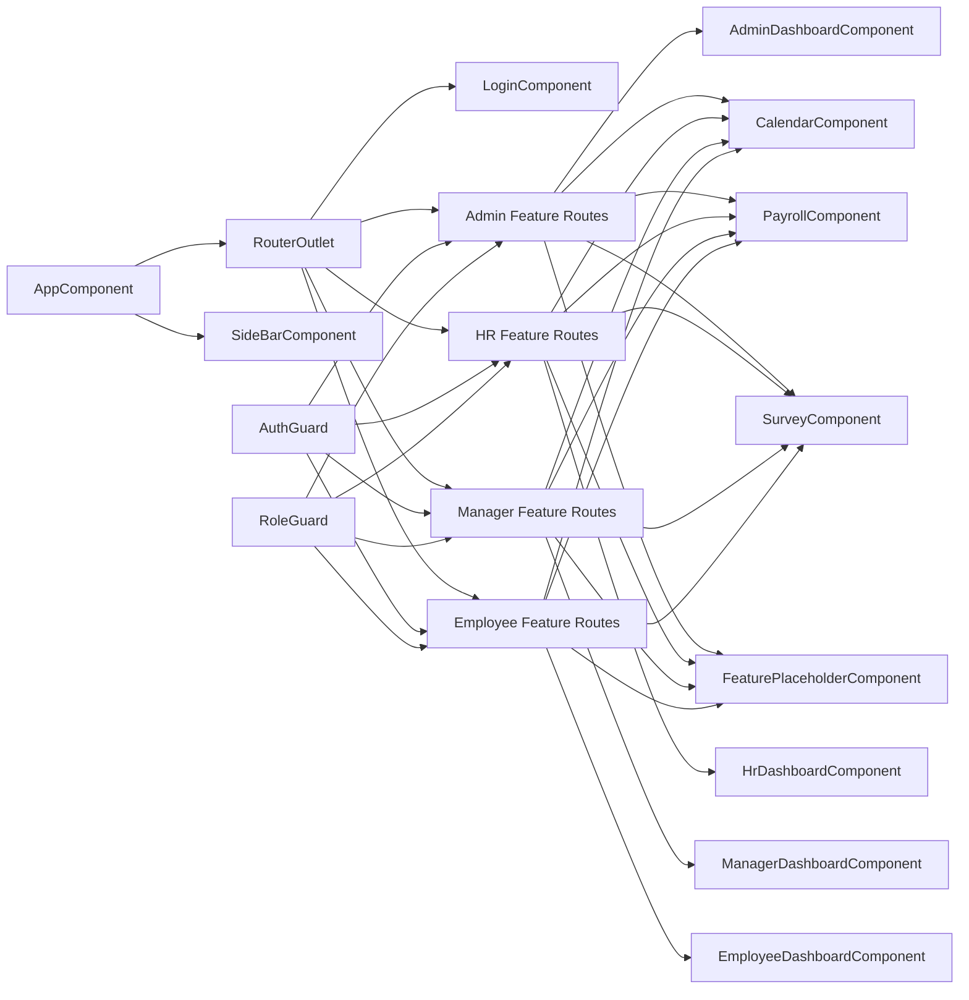
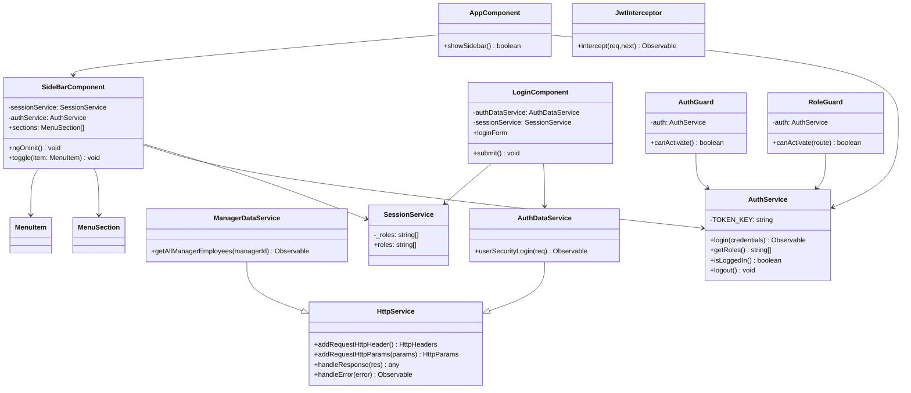
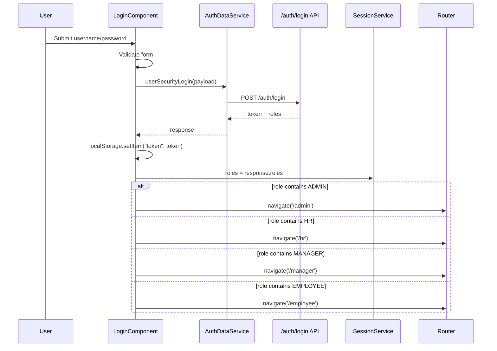
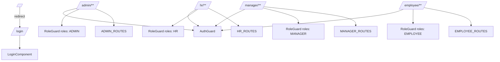

# Employee Management System UML

## 1) System Component Diagram

## 2) Class Diagram (Core + Shared + Auth)

## 3) Login + Role-Based Navigation Sequence

## 4) Route + Guard Diagram

## Source Files

- `src/app/app.routes.ts`
- `src/app/core/guards/auth.guard.ts`
- `src/app/core/guards/role.guard.ts`
- `src/app/auth/components/login/login.component.ts`
- `src/app/shared/components/side-bar/side-bar.component.ts`
- `src/app/shared/services/HttpService.ts`
- `src/app/shared/services/auth-data.service.ts`
- `src/app/core/services/auth.service.ts`
